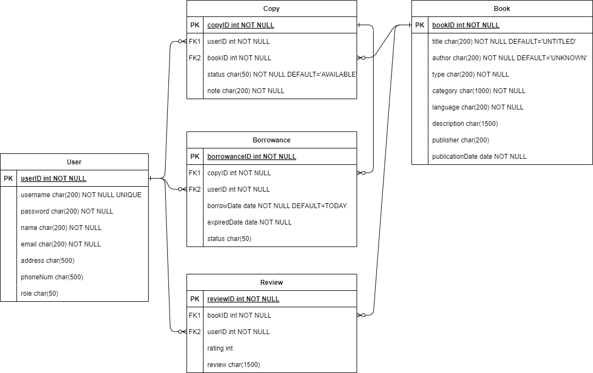
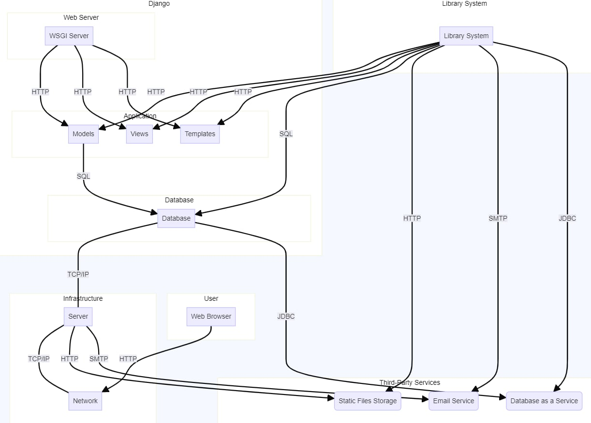
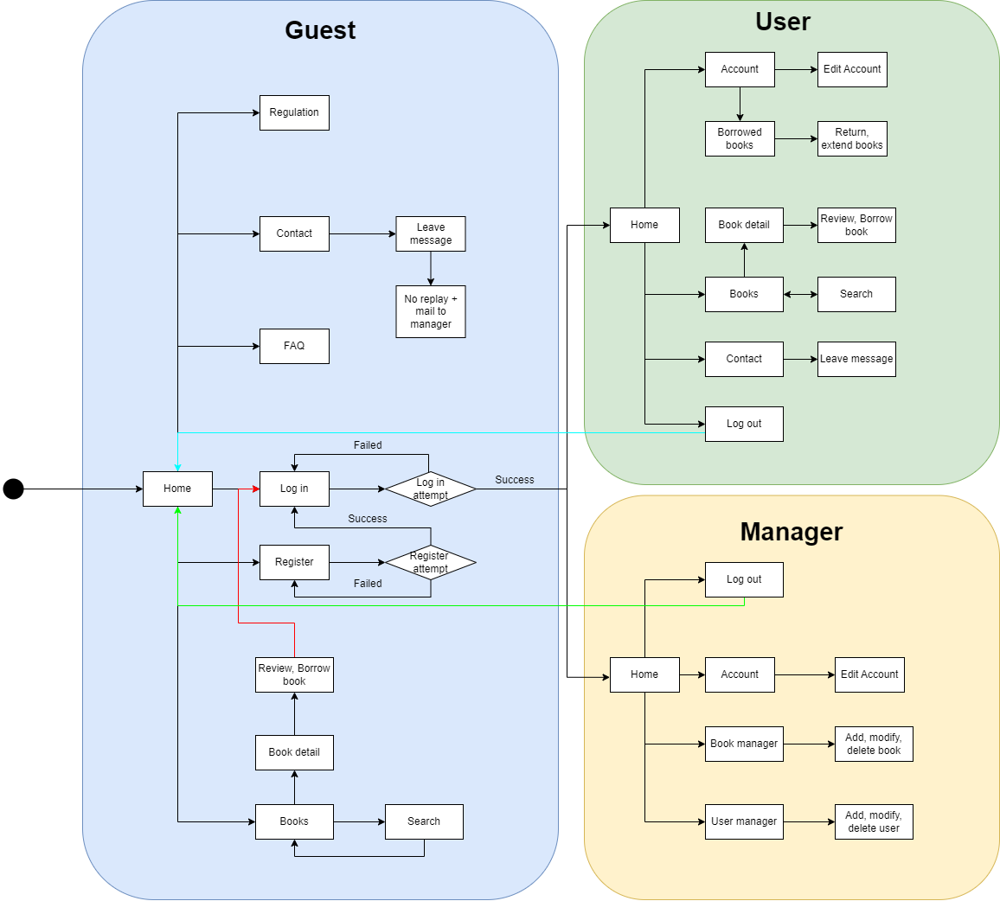

# Bibliotech. Online Library Management
***vgupe2024_team2***

## Team members
| Full Name    | Student's ID  |
| ------------ | ------------- |
| [Huỳnh Lê An Phú](https://github.com/TheFabulousP) | 10421100 |
| [Đỗ Minh Quang](https://github.com/minWang916) | 10421051 |
| [Lê Công Nguyên](https://github.com/lcnguyencs) | 10421043 |
| [Dương Thiên Hương](https://github.com/dxd1019) | 10421019 |
| [Phan Tâm Như](https://github.com/nhuhuynh1508) | 10421122 |
| [Nguyễn Minh Anh](https://github.com/sumirez) | 10421068 |


## Project Description
### Overview
The Online Library Management Application is a comprehensive system designed to facilitate the rental, review, and management of books through a user-friendly interface. The application supports three primary roles: Users, Moderators, and Admins.

### Features
- **User Interface**:
    - **Browse and Filter**: Users can browse books, filter them by categories, authors, publications, etc.
    - **Rent Books**: Users can rent books for a specified duration.
    - **Review and Like**: Users can like and review books.
    - **Moderator Application**: Users can apply to become moderators.

- **Moderator Interface**:
    - **Book Management**: Moderators can list and manage books, track their availability, and send notifications when leases expire.
    - **Approval Process**: Moderators submit books for admin approval before they become available to users.

- **Admin Role**:
    - **Approval**: Admins approve books submitted by moderators, ensuring quality and compliance.

### Technologies Used
- **Backend**:
    - **Django and Python**: Chosen for their robustness, scalability, and the extensive online resources available for development support. Django's built-in admin interface simplifies administrative tasks, making it an ideal choice for managing complex database operations and user roles.
- **Frontend**:
    - **Webflow**: Utilized to streamline the design-to-production process, allowing for rapid prototyping and a polished user interface. Webflow's visual editor makes it easy to create responsive designs without extensive front-end coding.

### Challenges faced
- **Backend-Frontend Linkage**: Integrating the backend and frontend was challenging, often leading to unexpected display issues and undesired effects on the backend interface.
- **Frontend Difficulties**: Implementing CSS properties efficiently to create a smooth and beautiful UI was a significant challenge for the front-end team.

### Future Features
- **Payment Integration**: We plan to implement a payment feature, allowing users to pay for book rentals seamlessly within the application.

## How to install and run the package
### Prequisites
- **Python 3.9 or higher:** Ensure Python is installed on your system. Our team use Python 3.9 to implement this project.
- **sqlite3:** Required for database view and management (optional).

### Installation Steps
1. **Clone the Repository:**
   ```sh
   git clone https://github.com/galvdat-hthieu/vgupe2024_team2.git
   cd vgupe2024_team2
   ```

2. **Install Required Packages:**
   Our team has already included a file named 'requirements.txt' that contained all packages needed to run this project smoothly. To install
the file, execute the following command in the terminal:
   ```sh
   pip install -r requirements.txt
   ```

### Running the Project
To run the project, execute the following command in the terminal:
```sh
python manage.py runserver
```

## File Structure


## Design and Architectures

### System requirement

-----

### Use Case Diagram
Our team have four actors in our system:
- Administrator (Admin): The admin is in charge of adding and modifying books, book items, and users. 
- User: The user can search the catalog, as well as checkout, reserve, renew, return a book, leave a review, etc.
- System: The system is responsible for sending notifications about the latest news onsite and update the status of the service that the users are currently using.
- Guest: The guest can access the webpage to view its content such as latest news from the library, the regulation or the FAQ. 

<a href=".document/diagrams/usecase/usecase_guest.png">Use case diagram for guest</a>

<a href=".document/diagrams/usecase/usecase_other.png">Use case diagram for user, moderator and admin</a>

-----

### Sequence Diagram

<a href=".document/diagrams/sequence/sequence_guest.png">Sequence diagram for guest functions: contact, search book, view books, read news</a>

<a href=".document/diagrams/sequence/sequence_register.png">Sequence diagram for "register" function</a>

<a href=".document/diagrams/sequence/sequence_login.jpg">Sequence diagram for "login" function</a>

<a href=".document/diagrams/sequence/sequence_addbook.png">Sequence diagram for "add book" function</a>

<a href=".document/diagrams/sequence/Review.svg">Sequence diagram for "user's book review" function</a>

-----

### E-R Class Diagram



-----

### Deployment Diagram



<!-- 

 -->

## Prototypes
Prototyped UI

Deployment here

## Credits
List all the tasks and history of contribution (if possible)

## Contributing
1. Fork and clone the repository
2. Create a new branch
3. Submit a pull request

## License
...